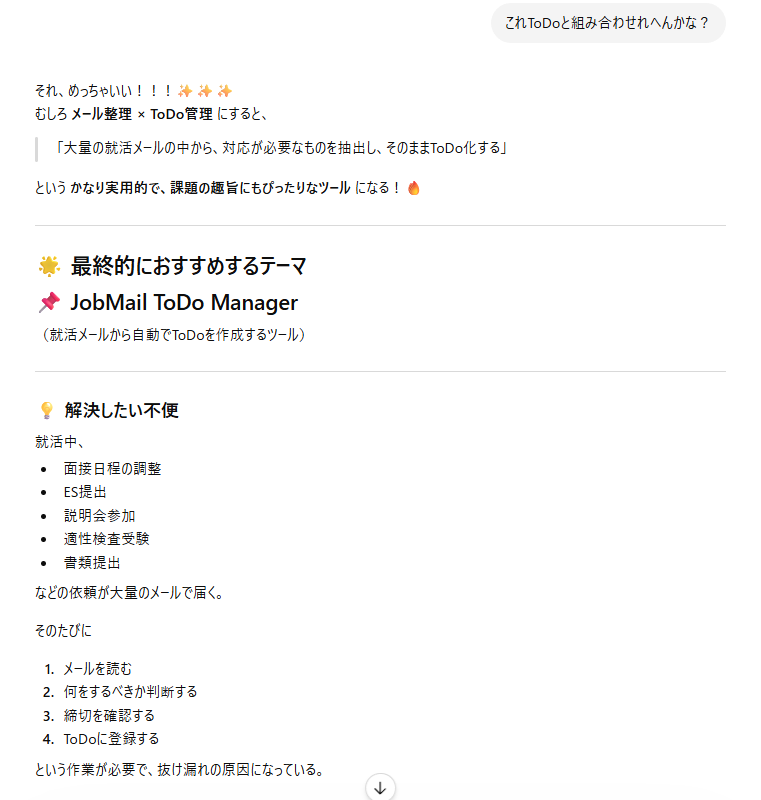
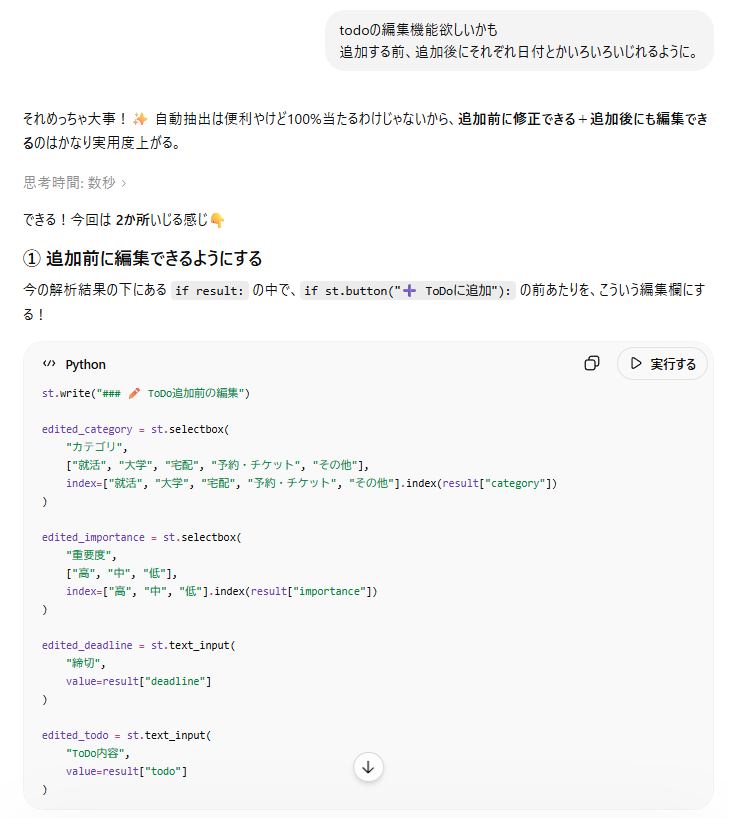
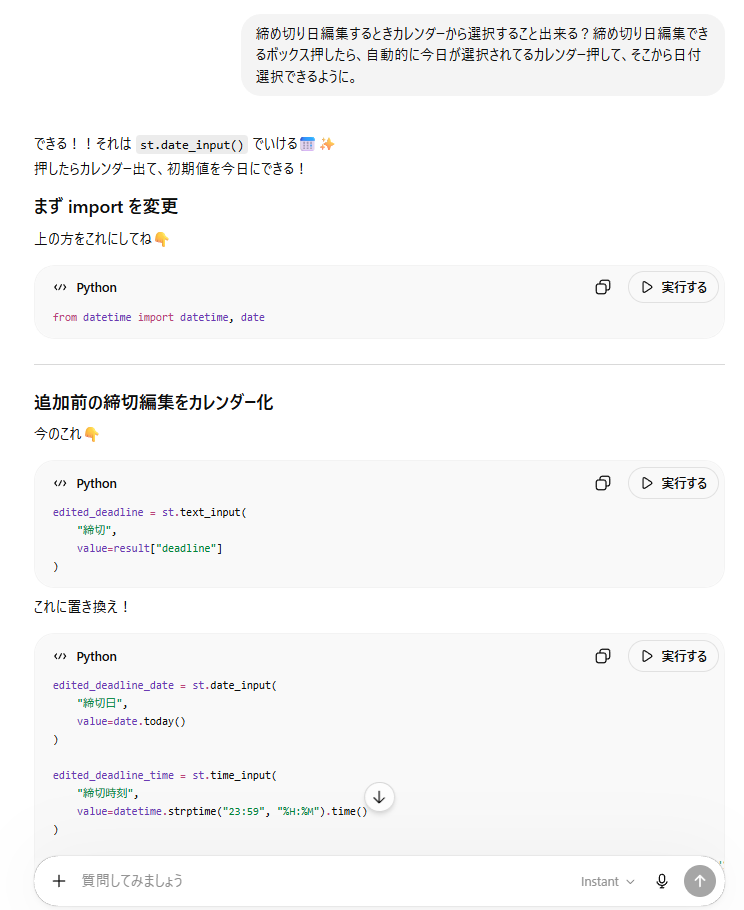

# mail-todo-sorter

メール本文を貼り付けるだけで、カテゴリ分類・重要度判定・締め切り抽出・ToDo生成を行い、一覧で管理できるWebアプリです。

## 何を作ろうと思ったか

メール本文を解析し、以下の情報を自動抽出してToDoとして管理するアプリを作成しました。

- カテゴリ（就活・大学・宅配・予約/チケット・その他）
- 関連先（企業名、教科名など）
- 重要度（高・中・低）
- 締め切り日時
- ToDo内容

抽出結果は編集可能で、ToDo一覧として保存・管理できます。

## なぜか

就職活動が始まり、企業からの面接案内や提出依頼、大学からの連絡、旅行やチケット予約の確認メール、迷惑メールなど、これまで以上に多くのメールを受け取るようになりました。
重要なメールの中には返信期限や提出期限が含まれているものも多く、内容を確認して手作業でToDoに転記することが手間でした。また、メールの件数が増えると必要な情報を見つけにくくなり、見落としの不安もありました。
そこで、メール本文を貼り付けるだけで必要な情報を自動的に整理し、ToDoとして管理できるツールを作成しました。

## 主な機能

### メール解析
- カテゴリ分類
- 重要度判定
- 締め切り日時抽出
- ToDo内容自動生成

### ToDo追加前の編集
- 解析結果を確認し、カテゴリや締め切り、ToDo内容を修正可能
- カテゴリに応じて入力欄が変化
    - 就活：企業名
    - 大学：教科名
    - 予約・チケット：交通/宿泊/遊び/その他

### ToDo管理
- JSONファイルに保存
- 締め切り順に表示
- チェックボックスによる完了チェック
- チェック済みToDoの削除
- 個別編集・削除

### 見やすさ向上
- カテゴリごとの背景色表示
- 重要度の表示
- 日付フィルター
- 「今日」ボタンで現在の日付に戻る機能

### 学習機能
- 新しく追加した企業名・教科名・ToDo内容を記憶し、次回以降の選択肢として利用

## 生成AIとのやり取り

開発全体を通してChatGPTを活用しました。

### 実際に入力したプロンプト例
- アイデアの具体化

- 編集機能の追加

- UI改善

### 工夫したやり取り
最初から完成形を目指すのではなく、メール解析、ToDo保存、編集機能、色分け、日付フィルターといったように、機能を段階的に追加しました。
また、実際にメールを解析しながら動作を確認し、「もっとこうしたい」と感じた点について、その都度生成AIに改善したい内容を伝え、UIや操作性を高めました。

## 詰まったところとどう乗り越えたか
### 詰まったところ
- ToDo追加後にメール入力欄初期化や、「今日」ボタンの実装時に、`st.session_state` 関連のエラーが発生してしまったこと
- 編集画面で前回の入力値が残ってしまったこと
- 「予約・チケット」から「就活」など、カテゴリ変更時に以前のToDo候補が残ってしまったこと

### 乗り越え方
エラーや想定通りに動作しない部分があった際には、現在のコード全体を共有し、どこに問題があるのかを確認しました。提示された修正内容を反映しながら動作確認を繰り返し、原因を特定して改善しました。
また、実装したい機能については、現在の動作と理想の動作を具体的に言葉で説明しました。例えば、「編集ボタンを押した時だけ編集画面を表示したい」「カテゴリによって入力欄を切り替えたい」「日付を選択してその日のToDoだけを表示したい」といったように、完成形のイメージを伝えることで、生成AIからより適切な提案を得ることができました。

## 次にやるなら何を変えるか
- Gmailと連携し、メール受信時に自動解析する
- Googleカレンダーと連携し、締め切りを自動登録する
- カテゴリや重要度で絞り込みできるようにする
- 締め切りが近いToDoを強調表示する
- 自動解析技術の向上（企業名の表記ゆれや、より複雑なメール表現への対応）